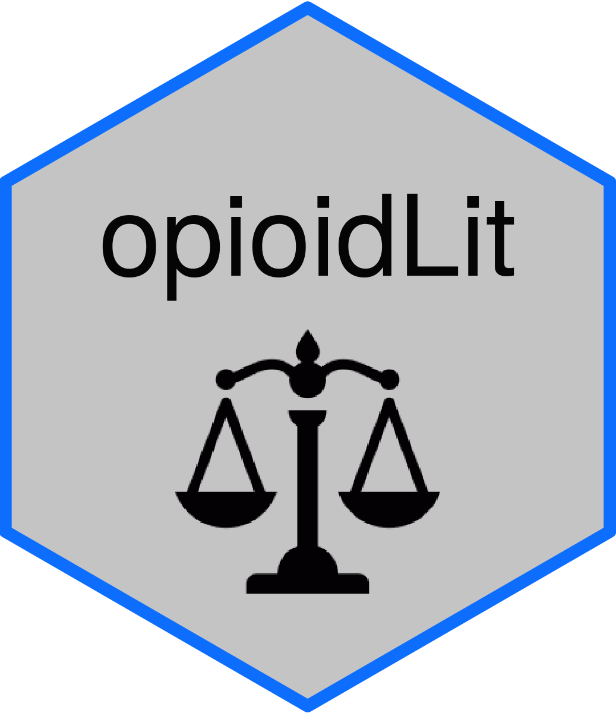

<!-- README.md is generated from README.Rmd. Please edit that file -->

# opioidLit 

<!-- badges: start -->
<!-- badges: end -->

The goal of opioidLit is to give easy access to the Opioid Industry
Document Archives (“OIDA”).

## About

According to OIDA’s
[website](https://www.industrydocuments.ucsf.edu/opioids/about/overview/),
“\[t\]he Opioid Industry Documents Archive was created by UCSF and Johns
Hopkins University in 2021. It preserves and provides permanent public
access to previously-internal corporate documents released from opioid
litigation and other sources. The documents shed light on the opioid
industry during the height of the U.S. opioid crisis.” As of Sepember
27, 2022, the archive contained 8.9 million pages and 1.5 million
documents.

## Installation

You can install the development version of opioidLit like so:

``` r
# install.packages("devtools")
devtools::install_github("RobWiederstein/opioidLit/")
```

## Code of Conduct

Please note that the opioidLit project is released with a [Contributor
Code of
Conduct](https://contributor-covenant.org/version/2/1/CODE_OF_CONDUCT.html).
By contributing to this project, you agree to abide by its terms.
